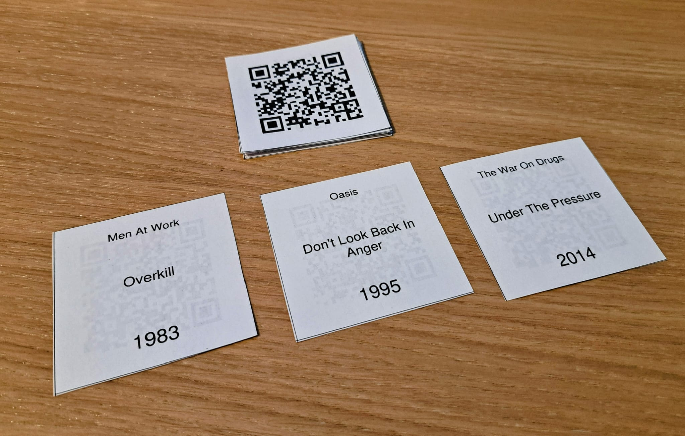

# Blind Song Scanner - Generator

> **Live on:** [generate.blindsongscanner.com](https://generate.blindsongscanner.com/)

Web app that takes a Spotify playlist link and allows the user to create tiles with the song details on one side and a track QR code on the other. 
These QR codes can be scanned by the Blind Song Scanner web app to play the songs: [https://github.com/Theys96/blind-song-scanner](https://github.com/Theys96/blind-song-scanner)

